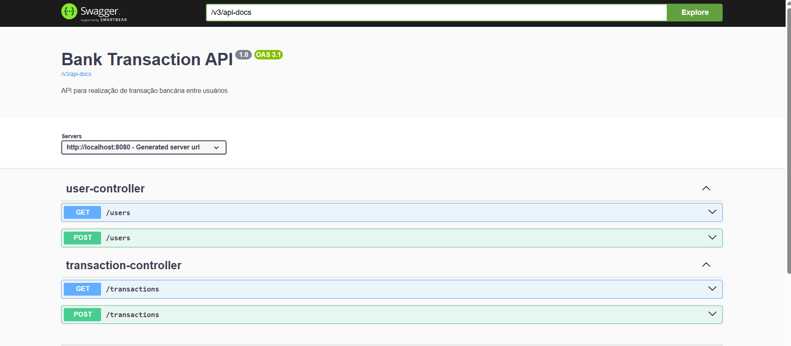
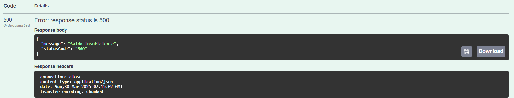
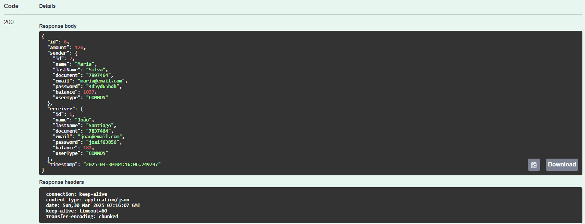
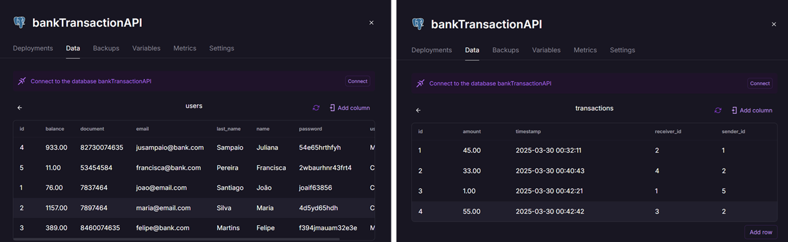

# bankTransactionAPI

[](https://github.com/dominuuus/bankTransictionAPI)

## 📌 Descrição

Este projeto foi desenvolvido como desafio de código do bootcamp **Decola Tech 2025**, com o objetivo de publicar uma **API REST** na nuvem utilizando **Spring Boot 3**, **Java 17** e **Railway**. Trata-se de uma simulação de **transferência bancária** entre clientes de um banco.

---

## 📑 Sumário

- [Tecnologias Utilizadas](#-tecnologias-utilizadas)
- [Funcionalidades](#-funcionalidades)
- [Instalação](#-instalação)
- [Como Usar](#-como-usar)
- [Desafios e Aprendizados](#-desafios-e-aprendizados)
- [Contribuição](#-contribuição)
- [Licença](#-licença)


## 🚀 Tecnologias Utilizadas

O projeto foi desenvolvido com as seguintes tecnologias:

- **Java 17**
- **Spring Boot 3.4.4**
- **Maven** (Gerenciamento de dependências)
- **Swagger** (Documentação da API)
- **Railway** (Hospedagem do banco de dados online)
- **PostgreSQL** (Banco de dados relacional)

## Diagrama de Classes

```mermaid

classDiagram
    class User {
        +id: Integer
        +firstname: String
        +lastName: String
        +document: Integer
        +email: String
        +password: String
        +userType: String
        +account: Account
        +card: Card
        +features: Features
        +news: News
    }

    class Account {
        +number: String
        +agency: String
        +balance: Double
        +limite: Double
    }

    class Card {
        +number: String
        +limit: Double
    }

    class Features {
        +icon: String
        +description: String
    }

    class News {
        +icon: String
        +description: String
    }

    User "1" *-- "1" Account : contains
    User "1" *-- "1" Card : contains
    User "1" *-- "1" Features : has
    User "1" *-- "1" News : has

```mermaid

## ⚙️ Funcionalidades

- **Gerenciamento de Usuários:** Cada usuário (cliente) possui:
  - Primeiro e último nome
  - Email
  - Senha
  - Saldo
  - Tipo de acesso (Usuário Comum ou Empresarial)
  - Documento (CPF ou CNPJ)

- **Transferências Bancárias:**
  - Permite a realização de transações entre contas.
  - Validação do saldo disponível antes da transação.
  - Mensagem de erro exibida caso o usuário tenha saldo insuficiente.

- **Validação Externa das Transações:**
  - Utiliza o serviço externo [`util.devi.tools`](https://util.devi.tools/api/v2/authorize) para validar transações.
  - Se a resposta for `"success"`, a transação é concluída e o saldo é movimentado.
  - Caso contrário, a transação é rejeitada e os saldos permanecem inalterados.


## 📌 Desafios e Aprendizados

- ✅ Primeiro projeto backend com Spring Boot
- ✅ Publicação de API REST em produção
- ✅ Estudo aprofundado de Java para compreender conceitos essenciais
- ✅ Solução de problemas com integração PostgreSQL no Railway

Durante o desenvolvimento, enfrentei desafios na configuração do banco de dados PostgreSQL no Railway. Diversos tutoriais apresentavam erros na conexão, exigindo múltiplas tentativas até alcançar uma integração bem-sucedida. Além disso, utilizei IA Generativa para esclarecer dúvidas e aprimorar a lógica do código.


## 🤝 Contribuição
Toda contribuição será bem vinda! Por se tratar do meu primeiro projeto, precisei recorrer a fontes diferentes para construir o projeto, então acredito que há muitos ajustes a serem realizados.


## 📜 Aplicação na prática

- Swagger: documentação com os métodos implantados.


- Transferência realizada quando o usuário não possui saldo suficiente 


- Registro de transação com sucesso: aqui foram impressos todos os dados do banco, inclusive a senha. Mas se trata apenas de ilustração, pois alguns dados não devem estar disponíveis nesta consulta


- Registro do banco de dados no Railway: lista de usuários e registro das transações realizadas

